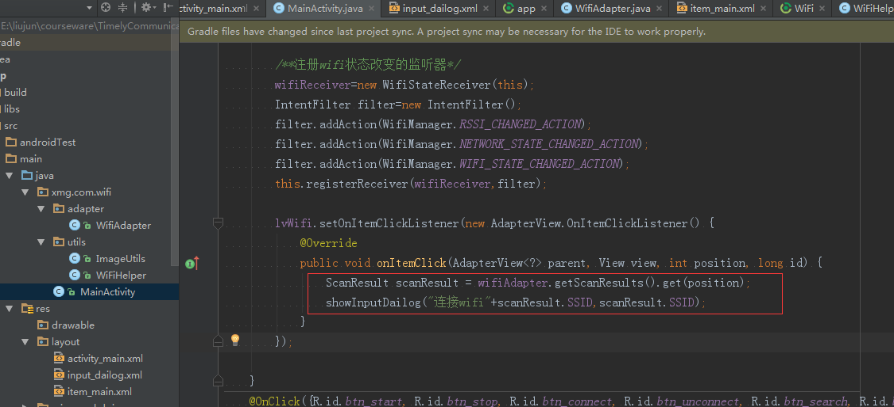

##Android Wifi开发##

ssid:   360免费WiFi-OA 

password:   12345678

###1.WIFI核心类###

###WifiManager###

**public class WifiManager**

*extends [Object]()* 

[的java.lang.Object](的java.lang.Object)

   ↳	android.net.wifi.WifiManager

这个类提供了管理Wi-Fi连接的所有方面的主要API。通过调用得到这个类的一个实例 [Context.getSystemService(Context.WIFI_SERVICE)](Context.getSystemService(Context.WIFI_SERVICE))。它涉及几类产品：

- 配置网络列表。该列表可以查看和更新，单个条目的属性进行修改。
- 当前活动的Wi-Fi网络，如果有的话。连接可以建立或拆除，并且有关网络的状态的动态信息可以查询。
- 接入点的扫描的结果，包含足够的信息来什么接入点连接到决策。
- 它定义了在任何类型的Wi-Fi状态变化的各种转播意向动作的名称。

这是表演的Wi-Fi具体操作时要使用的API。要执行一些与在抽象的层面与网络连接操作，使用[ConnectivityManager](ConnectivityManager)。


**常用公共方法**

- [int	addNetwork(WifiConfiguration config)]()
  添加一个新的网络描述为一套配置网络。


- [boolean	disableNetwork(int netId)]()
  禁用配置的网络。

  - [boolean disconnect()]()
    从当前活动的接入点撇清。

  - [boolean enableNetwork(int netId, boolean disableOthers)]()
    允许之前配置的网络与关联。
  - [List<WifiConfiguration>  getConfiguredNetworks()]()
    返回请求者配置的所有网络的列表。

  - [WifiInfo  getConnectionInfo()]()
    返回有关当前Wi-Fi连接的动态信息，如果有的话是积极的。

  - [DhcpInfo getDhcpInfo()]()
    从最后一次成功DHCP请求返回DHCP分配的地址，如果有的话。

  - [List<ScanResult> getScanResults()]()
    返回最新的接入点扫描的结果。

  - [intget WifiState()]()
    获取Wi-Fi功能的状态。

  - [boolean isWifiEnabled()]()
    返回的Wi-Fi是否已启用或禁用。


- [boolean	reconnect()]()
  重新连接到当前活动的访问点上，如果我们目前正在断开。

  - [boolean removeNetwork(int netId)]()
    从配置网络的列表中删除指定的网络。


- [boolean	setWifiEnabled(boolean enabled)]()
  启用或禁用无线网络连接。

  - [boolean startScan()]()
    请求接入点的扫描。
  - [int updateNetwork(WifiConfiguration config)]()
    更新现有配置的网络的网络描述。
### 2.新建一个WiFi项目


### 3.拷贝资源文件与添加权限

添加布局


添加权限

```
    <uses-permission android:name="android.permission.ACCESS_WIFI_STATE" />
    <uses-permission android:name="android.permission.CHANGE_WIFI_STATE" />
    <uses-permission android:name="android.permission.INTERNET" />
    <uses-permission android:name="android.permission.ACCESS_NETWORK_STATE"/>
```


### 4.在app/build.grade添加依赖和注解

```
    //butterknife
    compile 'com.jakewharton:butterknife:7.0.1'
    //glide
    compile 'com.github.bumptech.glide:glide:3.6.1'
```

###5.自动生成findID和OnClick事件


###6.新建一个WiFiHelper帮助类


###7.开始wifi功能


### 8.在onCreate方法中添加wifi状态监听器

1.注册广播监听器

```
/**注册wifi状态改变的监听器*/
wifiReceiver=new WifiStateReceiver(this);
IntentFilter filter=new IntentFilter();
filter.addAction(WifiManager.RSSI_CHANGED_ACTION);
filter.addAction(WifiManager.NETWORK_STATE_CHANGED_ACTION);
filter.addAction(WifiManager.WIFI_STATE_CHANGED_ACTION);
this.registerReceiver(wifiReceiver,filter);
```


2.广播接收者

```
    /**
     *  Wifi开关,信号,状态改变监听
     */
    public class WifiStateReceiver extends BroadcastReceiver {
        private static final String TAG = "WifiStateReceiver";
        Context context;
        
        public WifiStateReceiver(Context context) {
            this.context = context;
        }
        @Override
        public void onReceive(Context context, Intent intent) {
            if (intent.getAction().equals(WifiManager.RSSI_CHANGED_ACTION)) {

            } else if (intent.getAction().equals(WifiManager.NETWORK_STATE_CHANGED_ACTION)) {
                /**网络状态改变*/
                NetworkInfo info = intent.getParcelableExtra(WifiManager.EXTRA_NETWORK_INFO);
                if (info.getState().equals(NetworkInfo.State.CONNECTED)) {
                    Toast.makeText(MainActivity.this,"wifi连接成功",Toast.LENGTH_SHORT).show();
                } else if (info.getState().equals(NetworkInfo.State.DISCONNECTED)) {
                    Toast.makeText(MainActivity.this,"wifi连接失败",Toast.LENGTH_SHORT).show();
                }
            } else if (intent.getAction().equals(WifiManager.WIFI_STATE_CHANGED_ACTION)) {
                /**Wifi状态改变*/
                int wifistate = intent.getIntExtra(WifiManager.EXTRA_WIFI_STATE, WifiManager.WIFI_STATE_DISABLED);
                if (wifistate == WifiManager.WIFI_STATE_ENABLED) {/**wifi可用*/
                    Toast.makeText(MainActivity.this,"wifi打开成功",Toast.LENGTH_SHORT).show();
                } else if (wifistate == WifiManager.WIFI_STATE_DISABLED) {/**wifi不可用*/
                    Toast.makeText(MainActivity.this,"wifi关闭成功",Toast.LENGTH_SHORT).show();
                }
            }
        }

    }
```


3.取消注册监听

```
    @Override
   protected void onDestroy() {
        super.onDestroy();
        ButterKnife.unbind(this);
        unregisterReceiver(wifiReceiver);
   }
```


###9.关闭WiFi


### 10.添加并连接wifi

点击连接wifi


在wifiHelper中实现addNetWorkWAP这个方法

```
    /**
     * 添加并连接一个网络
     * @param ssid wifi名
     * @param password wifi密码
     */
    public void addNetworkWPA(String ssid,String password){
        WifiConfiguration config=CreateWifiInfo(ssid,password,3);
        int netId = mWifiManager.addNetwork(config);
        mWifiManager.enableNetwork(netId,true);
    }
```


创建一个wifi配置信息

```
    /**创建一个wifi配置信息*/
    private WifiConfiguration CreateWifiInfo(String SSID, String Password, int Type)
    {
        WifiConfiguration config = new WifiConfiguration();
        config.allowedAuthAlgorithms.clear();
        config.allowedGroupCiphers.clear();
        config.allowedKeyManagement.clear();
        config.allowedPairwiseCiphers.clear();
        config.allowedProtocols.clear();
        config.SSID = "\"" + SSID + "\"";

        WifiConfiguration tempConfig = this.IsExsits(SSID);
        if(tempConfig != null) {
            mWifiManager.removeNetwork(tempConfig.networkId);
        }
        /**连接不需要密码的wifi*/
        if(Type == 1) //WIFICIPHER_NOPASS
        {
            config.wepKeys[0] = "\"\"";
            config.allowedKeyManagement.set(WifiConfiguration.KeyMgmt.NONE);
            config.wepTxKeyIndex = 0;
        }
        /**连接wep格式加密wifi*/
        if(Type == 2) //WIFICIPHER_WEP
        {
            config.hiddenSSID = true;
            config.wepKeys[0]= "\""+Password+"\"";
            config.allowedAuthAlgorithms.set(WifiConfiguration.AuthAlgorithm.SHARED);
            config.allowedGroupCiphers.set(WifiConfiguration.GroupCipher.CCMP);
            config.allowedGroupCiphers.set(WifiConfiguration.GroupCipher.TKIP);
            config.allowedGroupCiphers.set(WifiConfiguration.GroupCipher.WEP40);
            config.allowedGroupCiphers.set(WifiConfiguration.GroupCipher.WEP104);
            config.allowedKeyManagement.set(WifiConfiguration.KeyMgmt.NONE);
            config.wepTxKeyIndex = 0;
        }
        /**连接WPA格式加密wifi（就是我们平时使用的加密方法）*/
        if(Type == 3) //WIFICIPHER_WPA
        {
            config.preSharedKey = "\""+Password+"\"";
            config.hiddenSSID = true;
            config.allowedAuthAlgorithms.set(WifiConfiguration.AuthAlgorithm.OPEN);
            config.allowedGroupCiphers.set(WifiConfiguration.GroupCipher.TKIP);
            config.allowedKeyManagement.set(WifiConfiguration.KeyMgmt.WPA_PSK);
            config.allowedPairwiseCiphers.set(WifiConfiguration.PairwiseCipher.TKIP);
            //config.allowedProtocols.set(WifiConfiguration.Protocol.WPA);
            config.allowedGroupCiphers.set(WifiConfiguration.GroupCipher.CCMP);
            config.allowedPairwiseCiphers.set(WifiConfiguration.PairwiseCipher.CCMP);
            config.status = WifiConfiguration.Status.ENABLED;
        }
        return config;
    }

    private WifiConfiguration IsExsits(String str){
        List<WifiConfiguration> existingConfigs = mWifiManager.getConfiguredNetworks();
        for (WifiConfiguration existingConfig : existingConfigs){
            if (existingConfig.SSID.equals(str.trim())){
                return existingConfig;
            }
        }
        return null;
    }
```


### 11.测试网络（加载网上中的一种图片）

新建一个图片加载工类

```
public class ImageUtils {

    public  static void  disPlayImage(Context activity, String url, ImageView imageView){
        Glide.with(activity).load(url).diskCacheStrategy(DiskCacheStrategy.ALL).into(imageView);
    }

    public  static void  disPlayImageNoCache(Context activity, String url, ImageView imageView, RequestListener requestListener){
            Glide
                .with(activity)
                .load(url)
                .listener(requestListener)
                .into(imageView);
    }
}
```

完成图片的加载


### 12.断开某个已经连接的wifi


### 13.搜索附近的wifi

在Android6.0以后，默认是搜索不要附近WIFI的列表的，需要将其APP加载到系统的APP安装目录(/system/app)下，也可以添加如下权限，但是该权限需要用户设置同意，所以我们可以引导用户去启动位置的权限。

<uses-permission android:name="android.permission.ACCESS_COARSE_LOCATION"/>
<uses-permission android:name="android.permission.ACCESS_FINE_LOCATION"/>


扫描附近wifi


实现点击收索wifi


编写WifiAdatper


```

    @Override
    public View getView(int i, View convertView, ViewGroup viewGroup) {
        ViewHolder viewHolder=null;
        if (convertView == null) {
            viewHolder=new ViewHolder();
            convertView = LayoutInflater.from(context).inflate(R.layout.item_main,null, false);
            viewHolder.wifiName= (TextView) convertView.findViewById(R.id.tv_wifiName);
            viewHolder.wifiLeve= (TextView) convertView.findViewById(R.id.tv_wifiLeve);
            convertView.setTag(viewHolder);
        }else {
            viewHolder = (ViewHolder) convertView.getTag();
        }
        ScanResult scanResult = scanResults.get(i);
        if(scanResult!=null) {
            viewHolder.wifiName.setText("Wifi名称："+scanResult.SSID);
            viewHolder.wifiLeve.setText("信号强度："+scanResult.level);
        }
        return convertView;
    }
```


### 8.点击连接附近wifi

点击搜索出来的wifi




显示一个输入密码的对话框


```
    public void showInputDailog(String tip, final String ssid) {
        //1.准备好一个布局
        View view = View.inflate(this, R.layout.input_dailog, null);
        TextView tv_tip = (TextView) view.findViewById(R.id.tv_tip);
        final EditText ed_ssid = (EditText) view.findViewById(R.id.ed_ssid);
        final EditText ed_password = (EditText) view.findViewById(R.id.ed_password);
        ed_ssid.setText(ssid);
        ed_ssid.setSelection(ssid.length());
        tv_tip.setText(tip);
		//2.创建对话框
        alertDialog = new AlertDialog.Builder(this)
                //添加一个布局
                .setView(view)
                .setPositiveButton("确认", null)
                .setNegativeButton("取消", new DialogInterface.OnClickListener() {
                    @Override
                    public void onClick(DialogInterface dialog, int id) {
                        alertDialog.cancel();
                    }
                })
                .create();
                
		//3.显示对话框
        alertDialog.show();
       
    }
```


点击确认连接wifi


###8.项目下载地址[github](https://github.com/LiuJunb/WifiDemo.git)###

